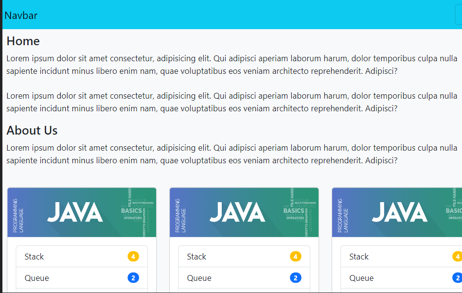

<a name="readme-top">Bootstrap practice</a>


<div align="center">
  
  <br/>

  <h3><b>Bootstrap practice</b></h3>

</div>

<!-- TABLE OF CONTENTS -->

# 📗 Table of Contents

- [📖 About the Project](#about-project)
  - [🛠 Built With](#built-with)
    - [Tech Stack](#tech-stack)
    - [Key Features](#key-features)
  - [🚀 Live Demo](#live-demo)
- [💻 Getting Started](#getting-started)
  - [Setup](#setup)
  - [Prerequisites](#prerequisites)
  - [Install](#install)
  - [Usage](#usage)
  - [Run tests](#run-tests)
  - [Deployment](#deployment)
- [👥 Authors](#authors)
- [🔭 Future Features](#future-features)
- [🤝 Contributing](#contributing)
- [⭐️ Show your support](#support)
- [🙏 Acknowledgements](#acknowledgements)
- [❓ FAQ (OPTIONAL)](#faq)
- [📝 License](#license)

<!-- PROJECT DESCRIPTION -->

# 📖 My Portfolio <a name="about-project"></a>

- **This is just a project to practice bootstrap**

## 🛠 Built With <a name="built-with"></a>

### Tech Stack <a name="tech-stack"></a>

<details>
  <summary>Client</summary>
  <ul>
    <li><a href="https://developer.mozilla.org/es/docs/Learn/HTML">HTML</a></li>
    <li><a href="https://developer.mozilla.org/es/docs/Web/CSS">CSS</a></li>
        <li><a href="https://getbootstrap.com/">Bootstrap</a></li>
  </ul>
</details>


<!-- Features -->

### Key Features <a name="key-features"></a>

- **It has a contact form**
- **It has a scrollspy**

<p align="right">(<a href="#readme-top">back to top</a>)</p>

<!-- LIVE DEMO -->

## 🚀 Live Demo <a name="live-demo"></a>

- [Live Demo Link](https://alejandroq12.github.io/bootstrap-practice/)

<p align="right">(<a href="#readme-top">back to top</a>)</p>

<!-- GETTING STARTED -->

## 💻 Getting Started <a name="getting-started"></a>

To get a local copy up and running, follow these steps:

### Prerequisites

In order to run this project you need:

1. A web browser to see the project.

2. And a code editor if you want to edit the code. For example, Vs Code.

### Setup

Clone this repository to your desired folder:

1. Clone it using your terminal:
```
git clone https://github.com/Alejandroq12/bootstrap-practice.git
```

2. If the previous method does not work you may also download the repo as a .zip file and once you decompress the .zip file you are ready to use it.

Important: do not forget to clone the repo in the correct folder, probably you will use the following commands to achieve that in your terminal:

1. To navigate a certain folder:

```
cd <folder name>
```
2. To navigate to the previous folder: 

```
cd ..
```

### Install

Install this project with:

1. To see this project you will not need to install something else.

### Usage

To see this project you will only need to:

1. Open the index.html file with a web browser.

### Run tests

To run tests, run the following command:

```
No test available right now.

```

### Deployment

You can deploy this project using GitHub pages:

1. Log in to your GitHub account and navigate to the repository that contains your website files.
2. Make sure that your website files are located in the main branch and in the root directory of the repository.
3. If your website is not already live, make sure that the index.html file is the main page of your website.
4. Click on the "Settings" tab in your repository.
5. Scroll down to the "GitHub Pages" section.
6. In the "Source" dropdown menu, select the branch where your website files are located. For a simple website with only HTML and CSS, this is typically the main branch.
7. In the "Path" field, make sure that the root directory is specified (i.e., "/").
8. Click "Save" to generate your website.
9. Wait a few minutes for GitHub to build and deploy your website.
10. Once the website is deployed, visit the GitHub Pages URL to view your site.

<p align="right">(<a href="#readme-top">back to top</a>)</p>

<!-- AUTHORS -->

## 👥 Authors <a name="authors"></a>

👤 **Julio Quezada**

- GitHub: [Alejandroq12](https://github.com/Alejandroq12)
- Twitter: [@JulioAle54](https://twitter.com/JulioAle54)
- LinkedIn: [Julio Quezada](https://www.linkedin.com/in/quezadajulio/)

👤 **Juan Sanchez**

- GitHub: [Jean Louis](https://github.com/Mukaba)
- Twitter: [Jean Louis](https://twitter.com/JeanlouisMukaba)

<p align="right">(<a href="#readme-top">back to top</a>)</p>

<!-- FUTURE FEATURES -->

## 🔭 Future Features <a name="future-features"></a>

> Describe 1 - 3 features you will add to the project.

- [ ] **I will add the mobile version*
- [ ] **I will add breakpoints**

<p align="right">(<a href="#readme-top">back to top</a>)</p>

<!-- CONTRIBUTING -->

## 🤝 Contributing <a name="contributing"></a>

Contributions, issues, and feature requests are welcome!

Feel free to check the [issues page](../../issues/).

<p align="right">(<a href="#readme-top">back to top</a>)</p>

<!-- SUPPORT -->

## ⭐️ Show your support <a name="support"></a>

If you like this project please give a star.
Thanks in advance.
<p align="right">(<a href="#readme-top">back to top</a>)</p>

<!-- ACKNOWLEDGEMENTS -->

## 🙏 Acknowledgments <a name="acknowledgements"></a>

I would like to thank my friend Jean-louis for his support during our pair-programming sessions:
- Jean-louis: [Jean-louis](https://github.com/Mukaba)

<p align="right">(<a href="#readme-top">back to top</a>)</p>

<!-- FAQ (optional) -->

## ❓ FAQ (OPTIONAL) <a name="faq"></a>

- **Are you going to use React in the future?**

  - Yes! I will transform website into a React App.

- **Did you create this project from scratch?**

  - Yes! From zero, and I will improve it a lot.

<p align="right">(<a href="#readme-top">back to top</a>)</p>

<!-- LICENSE -->

## 📝 License <a name="license"></a>

This project is [MIT](./MIT.md) licensed.

<p align="right">(<a href="#readme-top">back to top</a>)</p>
